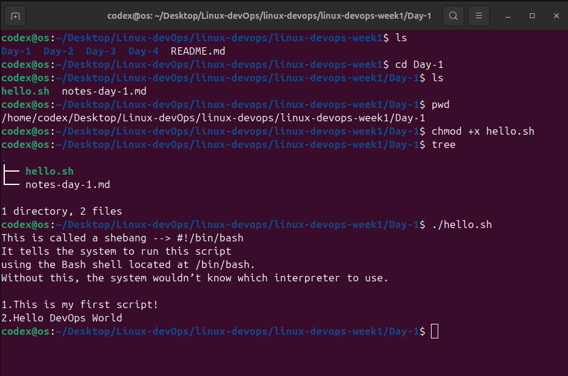

# Day 1 – Linux Filesystem & Bash Basics

## Linux Filesystem
- /        → root directory
- /home    → user home directories
- /etc     → configuration files
- /var     → logs and variable data
- /bin     → essential binaries

## Commands Practiced
pwd, ls, cd, tree, chmod

## Bash Basics
- Variables
- Executable scripts
- Shebang (#!/bin/bash)

## Below is the terminal output captured while running script:

