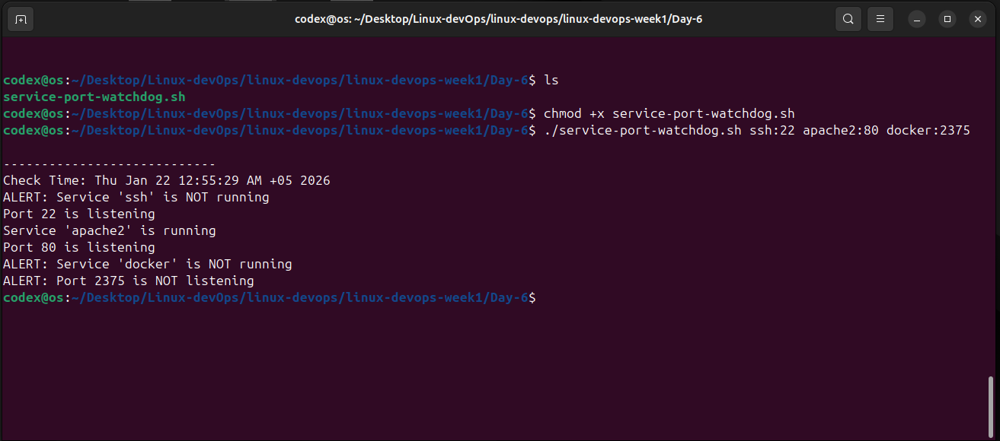

# Day 6 – Service & Port Watchdog

## Description
Built a monitoring script to check service availability and port status.

## Features
- Service status monitoring using systemctl
- Port listening check using ss
- Timestamped logging
- Automation-ready with cron

## DevOps Concepts
Monitoring, automation, logging, service reliability

## Below is the terminal output of running script

